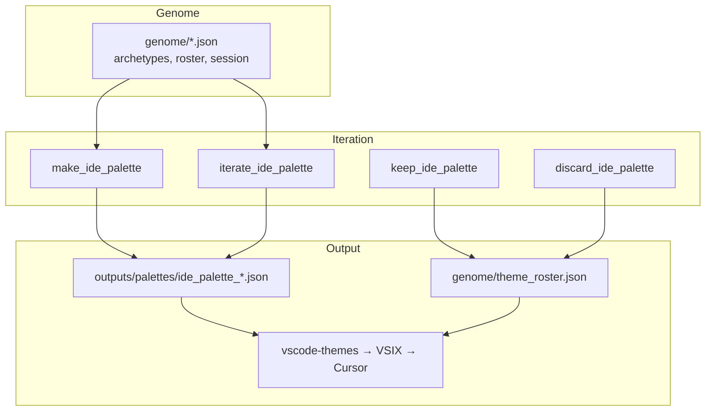

# RR IDE themes — agent instructions

Users prompt you in chat. **Do not tell them to run CLI commands** unless they explicitly ask.

## Architecture (agent path only)



**Web reuse:** same genes → `web sync <consumer>` or `core/pathways/web.py` for site-specific CSS. Register consumers in `genome/web_consumers.json`. Not part of the IDE chat loop.

## Primary flow (chat iteration)

**First attempt** — user says e.g. "make me a lemon palette":

```python
from pathlib import Path
from core.ide_theme import make_ide_palette

root = Path("Menhir Holdings/Color/Rob-Ross")
make_ide_palette(root, "lemon yellow light theme")
```

**Not happy yet** — user gives feedback ("warmer", "more lemon", "try cream"):

```python
from core.ide_theme import iterate_ide_palette

iterate_ide_palette(root, "lemon cream brighter, more chiffon")
# inherits style/light from last draft, new palette id, auto export + install
```

**User likes one** — "keep that one" / "save the lemon haze too":

```python
from core.ide_theme import keep_ide_palette

keep_ide_palette(root, "ide_palette_12")
```

**Drop one** — "remove bonfire" / "don't ship that":

```python
from core.ide_theme import discard_ide_palette

discard_ide_palette(root, "ide_palette_08")
```

## Rules

- **Always use** `make_ide_palette` → `iterate_ide_palette` → `keep_ide_palette`.
- Style is **inferred from prompt** when omitted (lemon → lemon_paper/cream, ocean → ion_storm, etc.).
- Each attempt gets a **new palette id** (append, not overwrite).
- Export ships **kept roster + current draft** only. Roster is empty until user says keep. Unwanted = never kept or `discard_ide_palette`. Files on disk outside roster are ignored by export.
- Naming: `theme_name` and `theme_display_name` are both `RR Word1 Word2`.
- `is_light` is a boolean on the palette JSON.
- Export + Cursor install are **automatic** on make/iterate/keep.
- After keeping themes for a website: `python cli.py web sync paid` (or add a consumer in `genome/web_consumers.json`).

Skip install (rare): `make_ide_palette(..., export=False, install=False)`.

## Style archetypes

`dracula_punch`, `fjord_hammer`, `alpenglow_paper`, `kimbie_warm`, `ion_storm`, `forest_canopy`, `void_forge`, `candy_voltage`, `night_siren`, `high_contrast_signal`, `lemon_paper`, `lemon_cream`

**Removed:** `bonfire_gold` — do not recreate.

## Key files

- `outputs/palettes/ide_palette_*.json` — source colors
- `genome/theme_roster.json` — kept themes (export list)
- `genome/ide_iteration_session.json` — current draft + iteration chain
- `vscode-themes/` — generated extension (`robross-ide-palettes`)

## Palette schema

```json
{
  "style_archetype": "lemon_cream",
  "is_light": true,
  "theme_name": "RR Lemon Custard",
  "theme_display_name": "RR Lemon Custard",
  "derived_from": "ide_palette_12",
  "iteration_index": 2
}
```

## Repair

```python
from core.ide_theme import finalize_ide_themes
finalize_ide_themes(root)  # roster + draft → VSIX + install
```

Only one extension: `local.robross-ide-palettes`.
