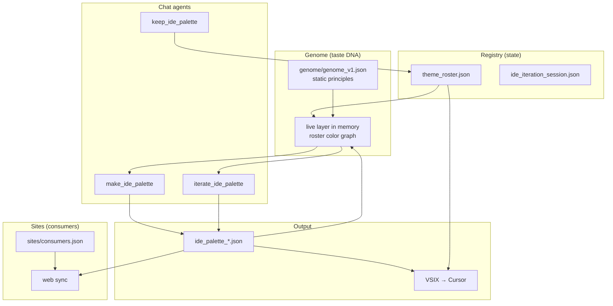

# RR IDE themes — agent instructions

Users prompt you in chat. **Do not tell them to run CLI commands** unless they explicitly ask.

## Architecture



**Genome** = static taste DNA + **dynamic live layer** derived from roster palette colors (features, hue relationships, synthesis). The live layer is never written to disk.

**Registry** = kept ids + draft session. **Sites** = downstream app paths (`sites/consumers.json`). Neither is genome.

## Primary flow (chat iteration)

```python
from pathlib import Path
from core.ide_theme import make_ide_palette, iterate_ide_palette, keep_ide_palette

root = Path("Menhir Holdings/Color/Rob-Ross")
make_ide_palette(root, "lemon yellow light theme")
iterate_ide_palette(root, "lemon cream brighter")
keep_ide_palette(root, "ide_palette_12")
```

**Drop:** `discard_ide_palette(root, "ide_palette_08")`

## Rules

- **Always use** `make_ide_palette` → `iterate_ide_palette` → `keep_ide_palette`.
- Export ships **kept roster + current draft** only.
- Naming: `theme_name` and `theme_display_name` are both `RR Word1 Word2`.
- Export + Cursor install are automatic on make/iterate/keep.
- Website tokens: `python cli.py web sync paid` after keep (see `sites/README.md`).

## Key paths

| Path | Role |
|------|------|
| `genome/genome_v1.json` | Static taste DNA |
| `registry/theme_roster.json` | Kept palette ids |
| `outputs/palettes/` | Palette JSON source of truth |
| `sites/consumers.json` | Where to push site tokens |

## Repair

```python
from core.ide_theme import finalize_ide_themes
finalize_ide_themes(root)
```

Only one extension: `local.robross-ide-palettes`.
