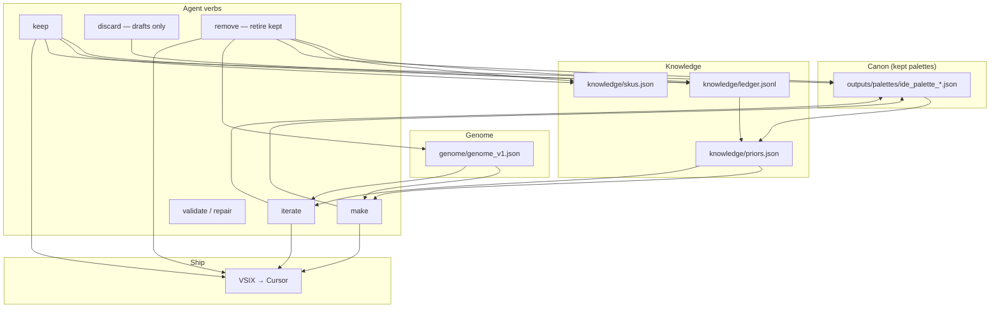

# RR IDE themes — agent contract (v3 canon control)

Users prompt you in chat. **Do not tell them to run CLI** unless they ask.

## Non-negotiable rules

1. **Never hand-edit** `registry/`, `knowledge/`, `genome/`, or `outputs/palettes/` for IDE theme lifecycle changes.
2. **Use the agent API only** — import from `core.agent_api`.
3. **`remove()`** retires a **kept** theme (by slug or `ide_palette_XX`).
4. **`discard()`** rejects an **unkept draft** only. It raises if you pass a kept theme.
5. **`repair()`** fixes drift after corruption; **`validate()`** checks health first.
6. **`scripts/reboot_from_canon.py`** is maintainer emergency only — not for normal removes.

Wrong: editing `theme_roster.json`, deleting palette JSON, patching `skus.json`, running reboot.  
Right: `remove(root, "bubblegum")` then `roster(root)` to confirm.

## Architecture


```mermaid
flowchart TB
  subgraph CANON["Canon (kept palettes)"]
    P["outputs/palettes/ide_palette_*.json"]
  end
  subgraph KNOW["Knowledge"]
    S["knowledge/skus.json"]
    L["knowledge/ledger.jsonl"]
    R["knowledge/priors.json"]
  end
  subgraph DNA["Genome"]
    G["genome/genome_v1.json"]
  end
  subgraph AGENT["Agent verbs"]
    M["make"]
    I["iterate"]
    K["keep"]
    D["discard — drafts only"]
    X["remove — retire kept"]
    V["validate / repair"]
  end
  subgraph OUT["Ship"]
    VX["VSIX → Cursor"]
  end

  P --> R
  L --> R
  R --> M & I
  G --> M & I
  M & I --> P
  K --> L & S & P
  D --> L
  X --> L & S & P & G
  K & X & M & I --> VX
```

## Primary API

```python
from pathlib import Path
from core.agent_api import (
    make, iterate, keep, discard, remove,
    roster, show, validate, repair, learn, finalize,
)

root = Path("Menhir Holdings/Color/RobRoss")

make(root, "dark theme with soft purple accents")
iterate(root, "more violet, less magenta")
keep(root, "ide_palette_23")
discard(root, "ide_palette_24")          # draft rejection only

remove(root, "bubblegum")              # retire kept theme by slug
remove(root, "ide_palette_16")           # or by palette id

roster(root)                           # includes health[] issues
validate(root)                         # [] = healthy
repair(root)                           # rebuild priors/genome/tiers from roster
show(root, "ide_palette_12")
finalize(root)                         # repair export/install
```

## Verb reference

| Verb | Target | Effect |
|------|--------|--------|
| `make` | prompt | New draft from priors + neighbors |
| `iterate` | prompt | Revise parent draft hexes |
| `keep` | palette id | Promote draft → canon; compounds DNA |
| `discard` | palette id | Reject **unkept** draft; negative signal |
| `remove` | slug or palette id | Retire **kept** theme; full GC + ship |
| `validate` | — | List consistency issues |
| `repair` | — | Fix priors/genome/tiers from roster |
| `learn` | — | Recompute priors only (lightweight) |
| `finalize` | — | Re-export VSIX |

### Retire themes (bubblegum, choco raspberry, etc.)

```python
remove(root, "bubblegum")
remove(root, "choco_raspberry")
validate(root)   # must return []
roster(root)     # confirm gone
```

`remove()` updates: roster, SKU registry, theme tiers, ledger (`type: remove`), priors, genome, user loop state, palette file deletion, VSIX reinstall.

### Draft vs canon

```
make → draft ide_24
  ├─ discard ide_24  →  draft deleted, canon unchanged
  └─ keep ide_24     →  canon gains ide_24

canon ide_22 (lemon_haze)
  └─ remove lemon_haze  →  retired from product; do NOT use discard
```

## Compounding rules

1. **make** seeds from nearest kept neighbors + priors; invents a fresh `RR …` slug.
2. **iterate** revises parent hexes from feedback — DNA unchanged until keep.
3. **keep** appends ledger, upserts SKU, recomputes priors, ships VSIX. Same-slug revision drops the predecessor from roster (`keep_replace`).
4. **discard** records avoided accent for drafts; never use on rostered themes.
5. **remove** records `remove` in ledger; deletes SKU, tiers entry, palette file; syncs genome.
6. Export ships **kept ∪ current draft** only. Extension: `local.robross-ide-palettes`.

## Naming

| Displayed | Internal slug |
|-----------|---------------|
| RR Lemon Haze | `lemon_haze` |
| RR Lemon Custard | `lemon_custard` |
| RR Fjord Hammer | `fjord_hammer` |
| … | snake_case of display core |

No marketing remaps. Slug ↔ Title Case is bijective.
